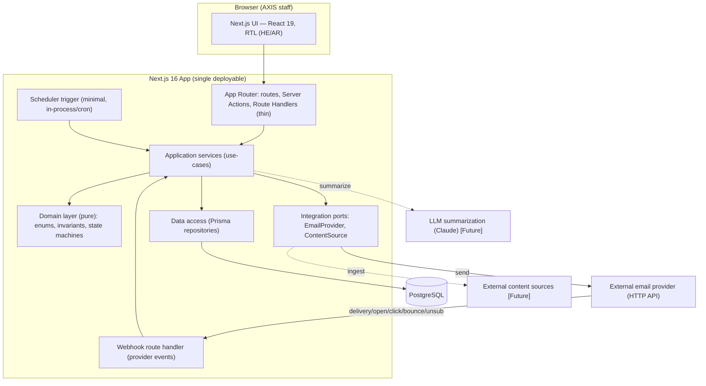
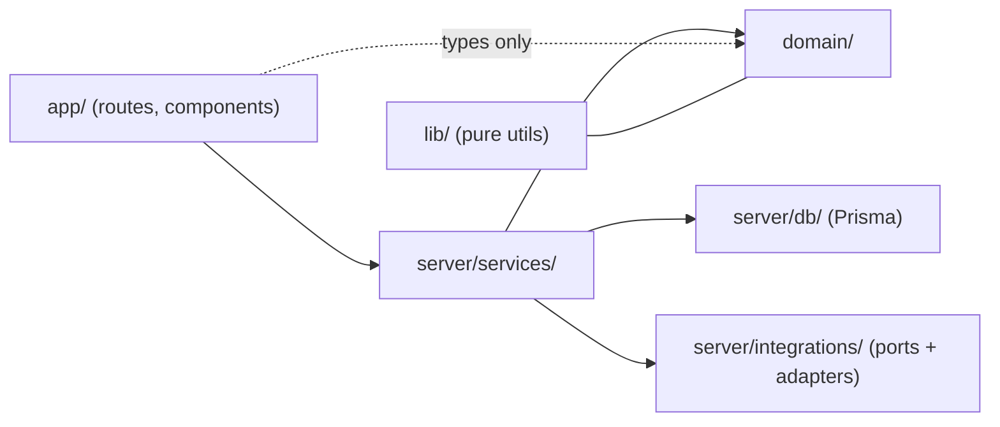
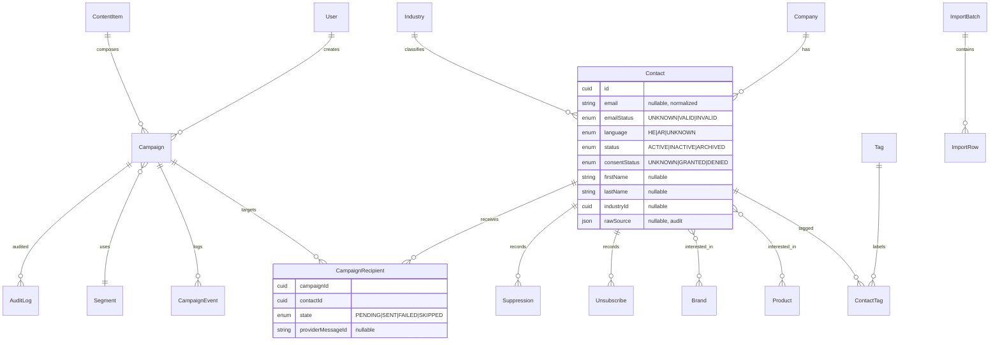
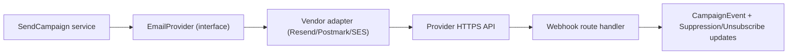
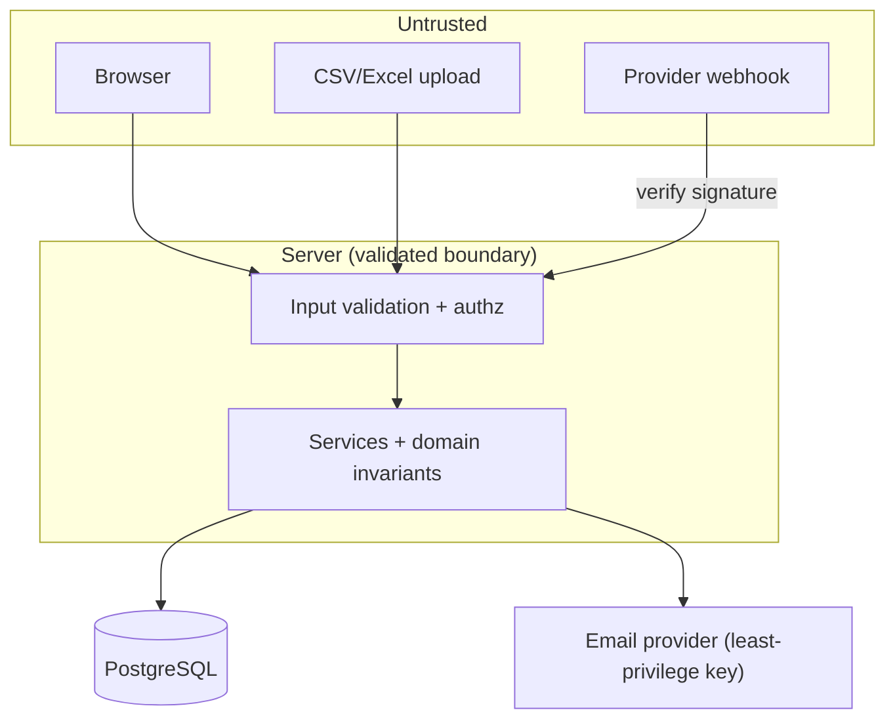

# Architecture — AXIS Customer Communication Platform

Status: **MVP foundation.** This describes the intended architecture for the MVP and the boundaries
that keep it maintainable. Future-only components are labeled **[Future]** and must not be built
until their milestone. When architecture changes, update this file and add an ADR.

Design priorities (in order): **correctness & sending safety → maintainability → simplicity**.
The system is small (~500–1,000 contacts); avoid infrastructure that scale does not yet justify.

---

## 1. System Components (MVP)



For the MVP the application is a **single Next.js deployable** plus **PostgreSQL**. The email
provider is external, reached over HTTPS behind a port. There is **no separate worker service, no
Redis, no queue** yet — see §5 and ADR-0005.

## 2. Domain Boundaries (layering)

Import direction is the rule (outer may import inner; never the reverse):



| Layer | Path | Responsibility | May import |
| --- | --- | --- | --- |
| Presentation | `src/app`, `src/ui` | Routes, layouts, RTL components. Thin. | services, domain types, lib |
| Application | `src/server/services` | Use-cases; orchestrate domain + persistence + ports; transactions. | domain, db, integrations, lib |
| Domain | `src/domain` | **Pure** business logic: enums, types, invariants, state machine, eligibility, classification. **No I/O.** | lib (pure) only |
| Persistence | `src/server/db` | Prisma client + repositories. | domain, lib |
| Integrations | `src/server/integrations` | Ports (`EmailProvider`, `ContentSource`) + adapters. | domain, lib |
| Shared | `src/lib` | Framework-agnostic utilities (validation, formatting). | — |

**Invariant:** `domain/` never imports Prisma, `fetch`, or framework code. This keeps business rules
unit-testable and vendor-independent.

## 3. Database

- **PostgreSQL** via **Prisma**; **all** schema changes through **migrations** (ADR-0002).
- Integrity enforced in the DB: foreign keys, `UNIQUE` (e.g. one active unsubscribe per
  contact/scope; one send-ledger row per campaign+contact), enum types, `NOT NULL` **only** where
  truly required.
- **Optional business metadata is nullable** (contacts/companies support partial data — see
  requirements §7). IDs are `cuid()`; every table has `createdAt`/`updatedAt`; audit/event tables are
  append-only with their own `occurredAt`.

Core entities (MVP, indicative — actual `schema.prisma` lands at the DB milestone):



`CampaignRecipient` doubles as the **idempotent send ledger**: a `UNIQUE(campaignId, contactId)`
constraint means a retry can never double-send.

## 4. Application Server

- **Next.js 16 App Router**, TypeScript strict. Server Components by default; `"use client"` only
  where interactivity requires it.
- **Server Actions / Route Handlers are thin**: validate input → call a service → map result. No
  business logic in the route layer.
- **Services** hold use-cases and own transactions. All authorization and domain invariants are
  checked here (and in `domain/`), never only in the UI.
- Runs as a single process for MVP; horizontally trivial to run behind a reverse proxy later.

## 5. Background Processing & Scheduling

**MVP (minimal, no queue):**
- Scheduling stores `sendAt` on the campaign. A **lightweight trigger** (a cron-invoked route handler
  or a small in-process interval, secured) periodically selects **due** `SCHEDULED` campaigns and
  invokes the send service.
- Sending iterates recipients and calls the `EmailProvider` port, writing an idempotent ledger row
  per recipient so the operation is **safe to retry** and resumable.

**[Future] — only when justified (ADR-0005):**
- If volume, retry semantics, or long-running sends outgrow in-process handling, introduce a
  **worker process + queue (BullMQ on Redis)**. The service interfaces are designed so the send/
  schedule use-cases can move behind a queue **without** changing domain logic.

Trigger point for the upgrade: sends that exceed request/serverless time limits, need concurrency
control/backoff across instances, or require durable retry beyond what the ledger + cron provides.

## 6. Email Provider Abstraction

- All sending goes through an internal **`EmailProvider` port** (interface) in
  `server/integrations`. A concrete adapter (Resend/Postmark/SES) implements it and is the **only**
  code aware of the vendor. See ADR-0004.



- **No direct Gmail/Outlook SMTP.** The vendor SDK/HTTP client is added **only** at the sending
  milestone. Inbound webhooks (delivered/open/click/bounce/complaint/unsubscribe) are verified,
  normalized, and written to the event log; hard bounces and complaints update the **suppression
  list** automatically.

## 7. Content Ingestion Boundary

- Ingestion is defined as a **`ContentSource` port**. Ingested items land as **review-pending**
  `ContentItem`s; a human reviews/approves before they can be used in a campaign.
- **[Future]** automated collectors implementing `ContentSource`; **[Future]** LLM summarization
  (Claude) applied to ingested items, always human-reviewed. Neither is built in MVP; only the
  boundary and the review-pending data concept may be established early.

## 8. Security Boundaries

- **AuthN:** Auth.js (NextAuth v5), credentials for MVP; sessions on every non-public route.
- **AuthZ:** role checks (`ADMIN`, `MANAGER`) in **services**, plus route/layout guards for UX.
  Four-eyes approval enforced server-side (creator ≠ approver unless ADMIN).
- **Trust boundaries:** the browser, CSV/Excel uploads, and provider webhooks are **untrusted**.
  Validate/parse all input into typed domain objects; verify webhook signatures.
- **Secrets** only via environment variables; `.env` git-ignored; `.env.example` committed.
- **Mass-mail controls** (recipient recompute, test isolation, idempotent ledger, typed
  confirmation, environment guard) are treated as security controls.



## 9. Deployment Model

- **Local dev:** Next.js dev server + **PostgreSQL in Docker**. `.env.local` from `.env.example`.
- **MVP deployment (assumption, to validate):** a single container image for the Next.js app +
  managed/containerized PostgreSQL, behind HTTPS. A cron trigger (platform scheduler or a small
  always-on instance) drives due-campaign sending. No Redis/worker until justified.
- **Migrations** run as a deploy step (`prisma migrate deploy`). Secrets injected via the platform's
  environment, never baked into the image.
- Exact hosting (VM/Docker host vs managed platform) is an **open deployment decision**; the
  single-deployable design keeps options open.

## 10. High-Level Data Flow (import → send)

```mermaid
sequenceDiagram
    actor Staff
    participant UI
    participant Import as Import service
    participant DB as PostgreSQL
    participant Camp as Campaign service
    participant Mgr as Manager
    participant Send as Send service
    participant Prov as EmailProvider

    Staff->>UI: Upload Hashavshevet CSV/Excel
    UI->>Import: Preview (parse+validate)
    Import-->>UI: Classified rows (SENDABLE/INCOMPLETE/NO_EMAIL/INVALID_EMAIL/DUPLICATE/ERROR)
    Staff->>Import: Confirm commit
    Import->>DB: Idempotent upsert (transaction) + raw source + batch
    Staff->>Camp: Build campaign (segment, language, content) [DRAFT]
    Staff->>Camp: Submit -> PENDING_APPROVAL
    Mgr->>Camp: Approve (four-eyes) -> APPROVED
    Staff->>Camp: Schedule (sendAt) -> SCHEDULED
    Note over Send: Trigger fires when now >= sendAt
    Send->>DB: Resolve segment, filter by LIVE eligibility
    Send->>DB: Create/lock recipient ledger rows (unique per contact)
    Send->>Prov: Send per eligible recipient (idempotent)
    Prov-->>Send: Webhook events (delivered/open/click/bounce/unsub)
    Send->>DB: Update events; suppress hard bounces/complaints
    Send->>DB: Campaign -> SENT (+ audit)
```

## 11. Testing Strategy (architecture view)

- **Unit** the `domain/` layer (state machine, eligibility, classification, validation) — no I/O,
  fast, exhaustive on edge cases.
- **Integration** services + repositories against a **test PostgreSQL** (import idempotency, ledger
  uniqueness, transactional rollback, authz).
- **E2E** the critical path (login → import preview → campaign → approve → test/schedule send) once
  the flow exists.
- The layering makes this feasible: pure domain is trivially testable; ports let integrations be
  faked in service tests.
