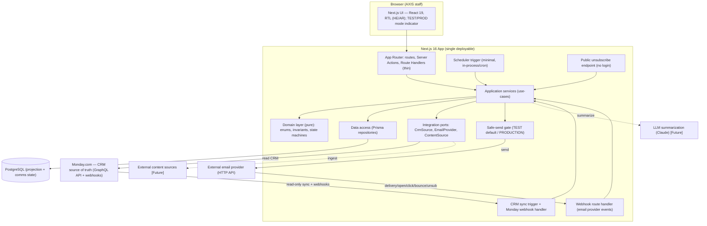
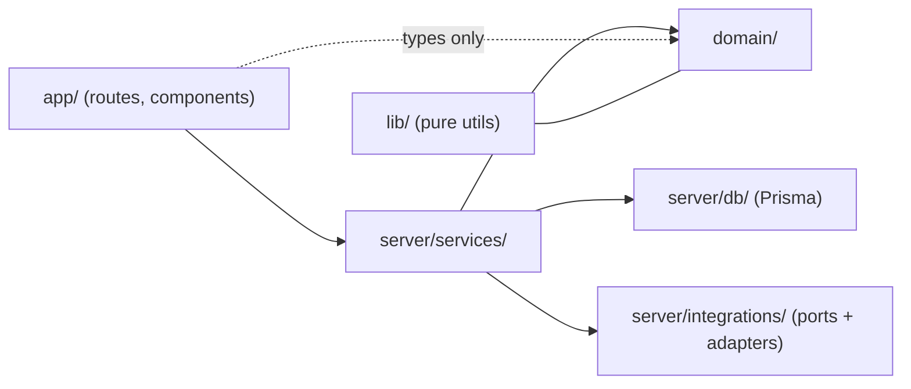
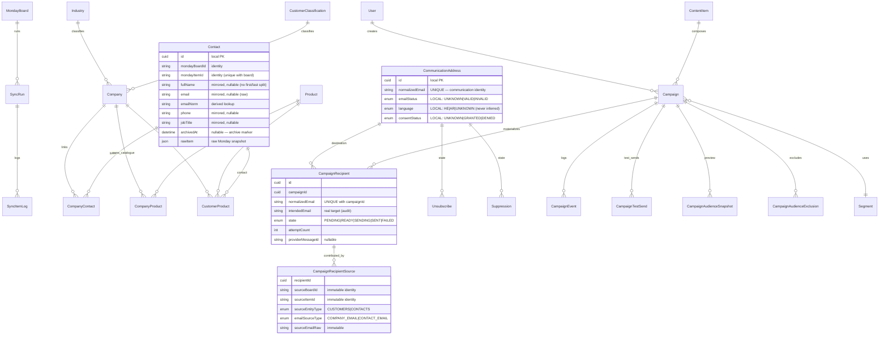
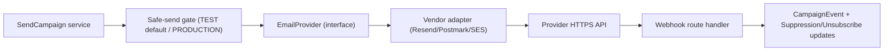
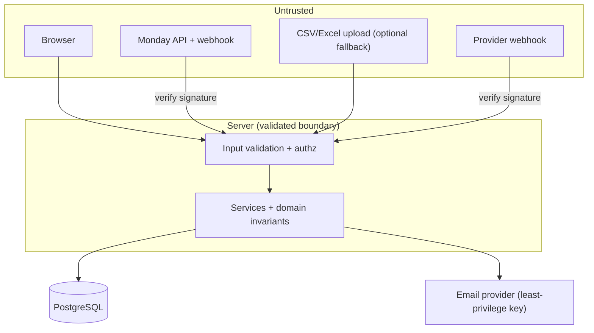

# Architecture — AXIS Customer Communication Platform

Status: **MVP foundation.** This describes the intended architecture for the MVP and the boundaries
that keep it maintainable. Future-only components are labeled **[Future]** and must not be built
until their milestone. When architecture changes, update this file and add an ADR.

Design priorities (in order): **correctness & sending safety → maintainability → simplicity**.
The system is small (~500–2,000 contacts); avoid infrastructure that scale does not yet justify.

---

## 1. System Components (MVP)



For the MVP the application is a **single Next.js deployable** plus **PostgreSQL**. **Monday.com is
the CRM source of truth**, read **read-only** via the Monday GraphQL API + webhooks behind a
`CrmSource` port; PostgreSQL holds the **projection** plus locally-owned communication state. The
email provider is external, reached over HTTPS behind a port, and **all sends pass through a
server-side safe-send gate** (ADR-0008). There is **no separate worker service, no Redis, no queue**
yet — see §5 and ADR-0005.

## 2. Domain Boundaries (layering)

Import direction is the rule (outer may import inner; never the reverse):



| Layer | Path | Responsibility | May import |
| --- | --- | --- | --- |
| Presentation | `src/app`, `src/ui` | Routes, layouts, RTL components. Thin. | services, domain types, lib |
| Application | `src/server/services` | Use-cases; orchestrate domain + persistence + ports; transactions. | domain, db, integrations, lib |
| Domain | `src/domain` | **Pure** business logic: enums, types, invariants, state machine, eligibility, classification. **No I/O.** | lib (pure) only |
| Persistence | `src/server/db` | Prisma client + repositories. | domain, lib |
| Integrations | `src/server/integrations` | Ports (`EmailProvider`, `ContentSource`) + adapters. | domain, lib |
| Shared | `src/lib` | Framework-agnostic utilities (validation, formatting). | — |

**Invariant:** `domain/` never imports Prisma, `fetch`, or framework code. This keeps business rules
unit-testable and vendor-independent.

## 3. Database

- **PostgreSQL** via **Prisma**; **all** schema changes through **migrations** (ADR-0002).
- Integrity enforced in the DB: foreign keys, `UNIQUE` (composite CRM identity
  `(mondayBoardId, mondayItemId)`; `CommunicationAddress.normalizedEmail`; **`CampaignRecipient
  (campaignId, normalizedEmail)`**; `CampaignRecipientSource (recipientId, sourceBoardId, sourceItemId,
  emailSourceType)`; `Unsubscribe (normalizedEmail, scope)`), enum types, `NOT NULL` **only** where
  truly required.
- **Optional business metadata is nullable** (contacts/companies support partial data — see
  requirements §7). IDs are `cuid()`; every table has `createdAt`/`updatedAt`; audit/event tables are
  append-only with their own `occurredAt`.
- **Email-centric communication state (ADR-0009):** local `emailStatus`/`language`/`consentStatus`
  live on **`CommunicationAddress`** (one row per `normalizedEmail`), **not** on CRM entities, and are
  never overwritten by sync. Email is never CRM identity.
- **Projection vs local ownership:** mirrored CRM records carry provenance (`mondayBoardId`,
  `mondayItemId`, `source`, `mondayUpdatedAt`, `syncedAt`, `rawItem`); locally-owned communication
  state (CommunicationAddress fields, unsubscribe, suppression, campaigns, recipients, events, audit)
  is **never** touched by sync. Monday deletion **archives** the projection.

Core entities (authoritative shape — ADR-0009):



**Deduplicated ledger:** `CampaignRecipient` is unique on **`(campaignId, normalizedEmail)`** — one
production delivery per campaign+email. Contacts/companies that share an email resolve through **one**
`CommunicationAddress` → **one** recipient, with **many** `CampaignRecipientSource` rows preserving
every contributing CRM record. `intendedEmail` is the real target; TEST redirects delivery without
polluting this ledger (test sends live in `CampaignTestSend`).

### 3.1 Per-field ownership boundary (Monday projection vs local state)

| Ownership | Fields | Sync behavior |
| --- | --- | --- |
| **Monday-owned (mirrored)** | identity `(mondayBoardId, mondayItemId)`, names, company↔contact link, `email`/`companyEmail`/`accountingEmail` (raw) + `*Norm`, phone, job title, **Company** industry / classification / category, product links, provenance (`source`, `mondayUpdatedAt`, `syncedAt`, `rawItem`) | **Overwritten** on every sync |
| **Locally-owned — `CommunicationAddress` (per normalized email)** | `emailStatus`, `language`, `consentStatus` | **Never** touched by sync |
| **Locally-owned — other** | `Unsubscribe`, `Suppression`/`SuppressionEvent`, `Campaign`, `CampaignRecipient`, `CampaignRecipientSource`, `CampaignEvent`, `CampaignTestSend`, `CampaignAudienceSnapshot`/`Exclusion`, `AuditLog`, `Segment`, archive flags, send-mode config | **Never** touched by sync |

`Company↔Contact` is **many-to-many** via `CompanyContact`; **Industry belongs to Company**; Contact
has **no** CRM status and **no** industry FK; **Brand/Tag are omitted** (absent in Monday). A Monday
item deletion **archives** the projection (`archivedAt` + `mondayDeletedAt`), never a hard delete.

New sync-support entities (created at the CRM sync milestone): **`MondayBoard`** (registered board +
column mapping + sync cursor), **`SyncRun`** (one sync execution), **`SyncItemLog`** (per-item audit +
classification), **`MondayWebhookEvent`** (raw inbound webhook, idempotency). These **replace** the
former `ImportBatch` / `ImportRow`.

## 4. Application Server

- **Next.js 16 App Router**, TypeScript strict. Server Components by default; `"use client"` only
  where interactivity requires it.
- **Server Actions / Route Handlers are thin**: validate input → call a service → map result. No
  business logic in the route layer.
- **Services** hold use-cases and own transactions. All authorization and domain invariants are
  checked here (and in `domain/`), never only in the UI.
- Runs as a single process for MVP; horizontally trivial to run behind a reverse proxy later.

## 5. Background Processing & Scheduling

**MVP (minimal, no queue):**
- **CRM sync (Monday → projection):** verified Monday **webhooks** drive incremental upserts; a
  scheduled **reconciliation** pulls via the Monday GraphQL API as a backstop. Each run is recorded as
  a `SyncRun` with per-item `SyncItemLog`; raw webhook events are stored for idempotency. Sync is
  **read-only** toward Monday and never overwrites locally-owned state.
- Scheduling stores `sendAt` on the campaign. A **lightweight trigger** (a cron-invoked route handler
  or a small in-process interval, secured) periodically selects **due** `SCHEDULED` campaigns and
  invokes the send service.
- Sending iterates recipients and calls the `EmailProvider` port, writing an idempotent ledger row
  per recipient so the operation is **safe to retry** and resumable.

**[Future] — only when justified (ADR-0005):**
- If volume, retry semantics, or long-running sends outgrow in-process handling, introduce a
  **worker process + queue (BullMQ on Redis)**. The service interfaces are designed so the send/
  schedule use-cases can move behind a queue **without** changing domain logic.

Trigger point for the upgrade: sends that exceed request/serverless time limits, need concurrency
control/backoff across instances, or require durable retry beyond what the ledger + cron provides.

## 6. Email Provider Abstraction

- All sending goes through an internal **`EmailProvider` port** (interface) in
  `server/integrations`. A concrete adapter (Resend/Postmark/SES) implements it and is the **only**
  code aware of the vendor. See ADR-0004.



- **No direct Gmail/Outlook SMTP.** The vendor SDK/HTTP client is added **only** at the sending
  milestone. Inbound webhooks (delivered/open/click/bounce/complaint/unsubscribe) are verified,
  normalized, and written to the event log; hard bounces and complaints update the **suppression
  list** automatically.
- **Safe-send gate (ADR-0008):** every send passes through a server-side gate. In `TEST` mode the
  effective delivery address is replaced with the configured safe-send address
  (`SAFE_SEND_REDIRECT_TO`, default `khaled-s@axis-gps.com`) while the intended recipient is retained
  on the ledger; `PRODUCTION` mode (explicit admin action) uses the real address. Test and production
  share eligibility, ledger, and idempotency logic — only the delivery address differs.

## 7. Content, newsletters & external ingestion (ADR-0010)

- **Multi-content composition:** `Campaign → CampaignContentItem[] → ContentItem` (ordered,
  include-flagged, per-item + campaign-level **snapshots** = authoritative sent history). Same item
  cannot be added twice per campaign.
- **Content sources & ingestion:** `ContentSource` (INTERNAL/RSS/WEBSITE/API/MANUAL_EXTERNAL) feeds
  ingested `ContentItem`s that land **`PENDING_REVIEW`**; `ContentIngestionRun` records runs.
  **Automatic collection ≠ automatic sending** — external content is human-approved before use;
  ingestion is idempotent by `(sourceId, externalId)`. **No network fetching is implemented** — only
  the data model + boundary.
- **Content Inbox** (future UI) surfaces collected items for Preview / Approve / Ignore / Add-to-
  Newsletter — non-technical, no terminal.
- **Recurring automation:** `NewsletterAutomation` (WEEKLY/MONTHLY, **ASSISTED**) prepares a **DRAFT**
  on schedule; `NewsletterAutomationRun @@unique(automationId, scheduledFor)` gives idempotent
  one-occurrence→one-campaign. Automation **never** auto-selects external content nor auto-sends; the
  scheduled send remains gated by approval + production-enable + live eligibility (ADR-0010 §9).
  Background scheduler execution is a later milestone.
- **[Future]** automated collectors implementing a `ContentSource` port; **[Future]** LLM
  summarization (Claude) of ingested items, always human-reviewed.

## 8. Security Boundaries

- **AuthN:** Auth.js (NextAuth v5), credentials for MVP; sessions on every non-public route.
- **AuthZ:** role checks (`ADMIN`, `MANAGER`) in **services**, plus route/layout guards for UX.
  Four-eyes approval enforced server-side (creator ≠ approver unless ADMIN).
- **Trust boundaries:** the browser, **Monday API responses/webhooks**, provider webhooks, and the
  optional CSV/Excel upload are **untrusted**. Validate/parse all input into typed domain objects;
  verify webhook signatures (Monday signing secret + challenge handshake; provider signatures).
- **Secrets** only via environment variables; `.env` git-ignored; `.env.example` committed.
- **Mass-mail controls** (server-side `SEND_MODE` safe-send gate with `TEST` default, recipient
  recompute, idempotent ledger, typed confirmation, environment guard; production toggle is an
  explicit admin action) are treated as security controls.
- **Public unsubscribe endpoint** is anonymous-safe: no login, unguessable scoped token, rate-limited;
  unsubscribe state is locally owned and sync-immune.



## 9. Deployment Model

- **Local dev:** Next.js dev server + **PostgreSQL in Docker**. `.env.local` from `.env.example`.
- **MVP deployment (assumption, to validate):** a single container image for the Next.js app +
  managed/containerized PostgreSQL, behind HTTPS. A cron trigger (platform scheduler or a small
  always-on instance) drives due-campaign sending **and CRM sync reconciliation**; a public route
  receives Monday and email-provider webhooks. No Redis/worker until justified.
- **Migrations** run as a deploy step (`prisma migrate deploy`). Secrets injected via the platform's
  environment, never baked into the image.
- Exact hosting (VM/Docker host vs managed platform) is an **open deployment decision**; the
  single-deployable design keeps options open.

## 10. High-Level Data Flow (Monday sync → send)

```mermaid
sequenceDiagram
    actor Staff
    participant Monday as Monday.com (SoT)
    participant Sync as CRM sync service
    participant DB as PostgreSQL (projection + comms)
    participant UI
    participant Camp as Campaign service
    participant Mgr as Manager
    participant Gate as Safe-send gate
    participant Send as Send service
    participant Prov as EmailProvider

    Monday->>Sync: Webhook / scheduled pull (read-only)
    Sync->>Sync: Classify items (SENDABLE/INCOMPLETE/NO_EMAIL/INVALID_EMAIL/CONFLICT/ERROR)
    Sync->>DB: Idempotent upsert by (mondayBoardId, mondayItemId) + rawItem + SyncRun/SyncItemLog
    Note over Sync,DB: Mirrors Monday-owned fields only; never overwrites unsubscribe/suppression/comms
    Staff->>UI: Build campaign (segment, language, content) [DRAFT]
    Staff->>Camp: Submit -> PENDING_APPROVAL
    Mgr->>Camp: Approve (four-eyes) -> APPROVED
    Staff->>Camp: Schedule (sendAt) -> SCHEDULED
    Note over Send: Trigger fires when now >= sendAt
    Send->>DB: Resolve segment, filter by LIVE eligibility (excl. unsubscribed/suppressed)
    Send->>DB: Create/lock recipient ledger rows (unique per contact) + intendedEmail
    Send->>Gate: Resolve effective address (TEST: safe-send; PRODUCTION: real)
    Gate->>Prov: Send per eligible recipient (idempotent)
    Prov-->>Send: Webhook events (delivered/open/click/bounce/unsub)
    Send->>DB: Update events; suppress hard bounces/complaints
    Send->>DB: Campaign -> SENT (+ audit)
```

## 11. Testing Strategy (architecture view)

- **Unit** the `domain/` layer (state machine, eligibility, classification, validation, safe-send
  resolver) — no I/O, fast, exhaustive on edge cases.
- **Integration** services + repositories against a **test PostgreSQL** (CRM sync idempotency, sync
  not overwriting locally-owned state, ledger uniqueness, transactional rollback, authz).
- **E2E** the critical path (login → CRM sync → campaign → approve → test/production send) once the
  flow exists.
- **Sending safety (ADR-0008):** unsubscribed contact cannot receive; unsubscribe survives sync; TEST
  mode never mails a real address and sends only to `khaled-s@axis-gps.com`; production switch is
  explicit; duplicate-send protection holds in both modes.
- The layering makes this feasible: pure domain is trivially testable; ports let integrations be
  faked in service tests.
